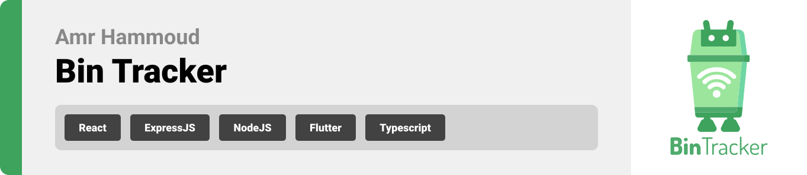

<br><br>

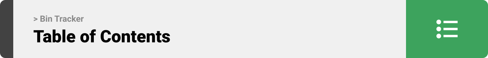


[Project Philosophy](#project-philosophy) • [User Stories](#user-stories) • [Prototyping](#prototyping) • [Mockups](#mockups) • [Admin Screens](#admin) • [IoT System](#iot) • [Teck Stack](#stacks) • [How to Run](#running)

<br><br>
<!-- project philosophy -->
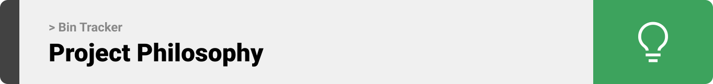


> An IoT-based Garbage Collection System that employs sensors within waste bins to monitor their fill levels. The data from these bins are analyzed using AI to generate actionable insights and recommendations.
>
> Bin Tracker aims to decrease the consumption of fuel by garbage trucks and help cities become more eco-friendly.

##### User-Stories

- As an admin, I want to view the bins on an interactive map.
- As an admin, I want to view real-time and historical data on bins fill levels to generate reports and make decisions based on data.
- As a user, I want to have a route suggestion on a map for me to follow and reduce unnecessary trips.
- As a super admin, I want to manage user accounts so that they can access the website.
- As an admin, I want to manage the bins, so that their data stays accurate.
- As an admin, I want to manage the trucks so that I can track their details on my dashboard.
- As an admin, I want to communicate with users using text messages so that we maintain live support.

<br><br>

<!-- Prototyping -->
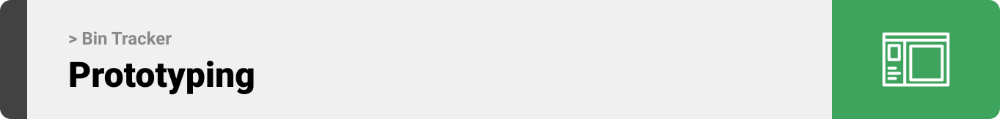


> we designed Bin Tracker using wireframes and mockups, iterating on the design until we reached the ideal layout for easy navigation and a seamless user experience.

### Wireframes

| Bins Map screen  | Dashboard screen |  Bin Management screen |
| ---| ---| ---|
| 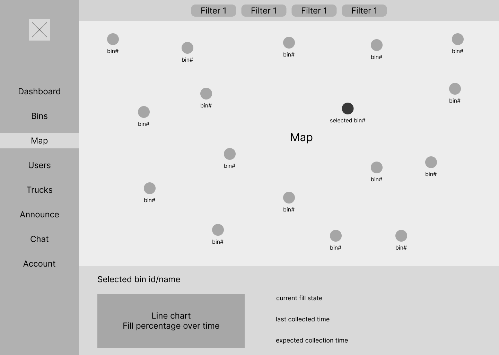 | 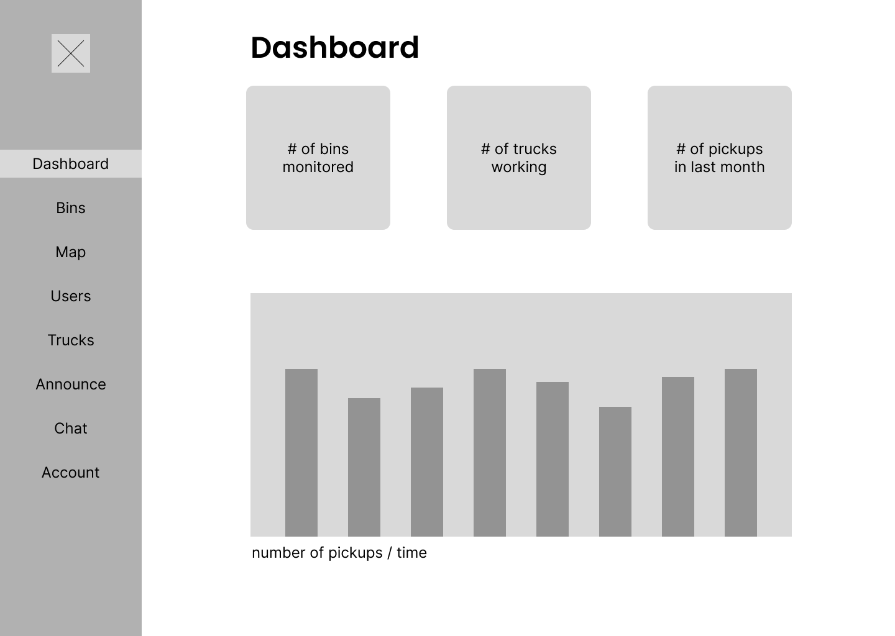 | 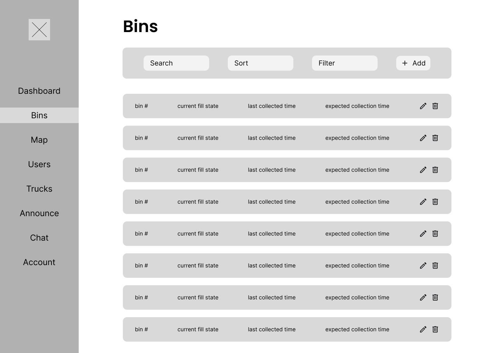 |


### Mockups

| Map screen  | Dashboard screen |  Bin Management screen |
| ---| ---| ---|
| 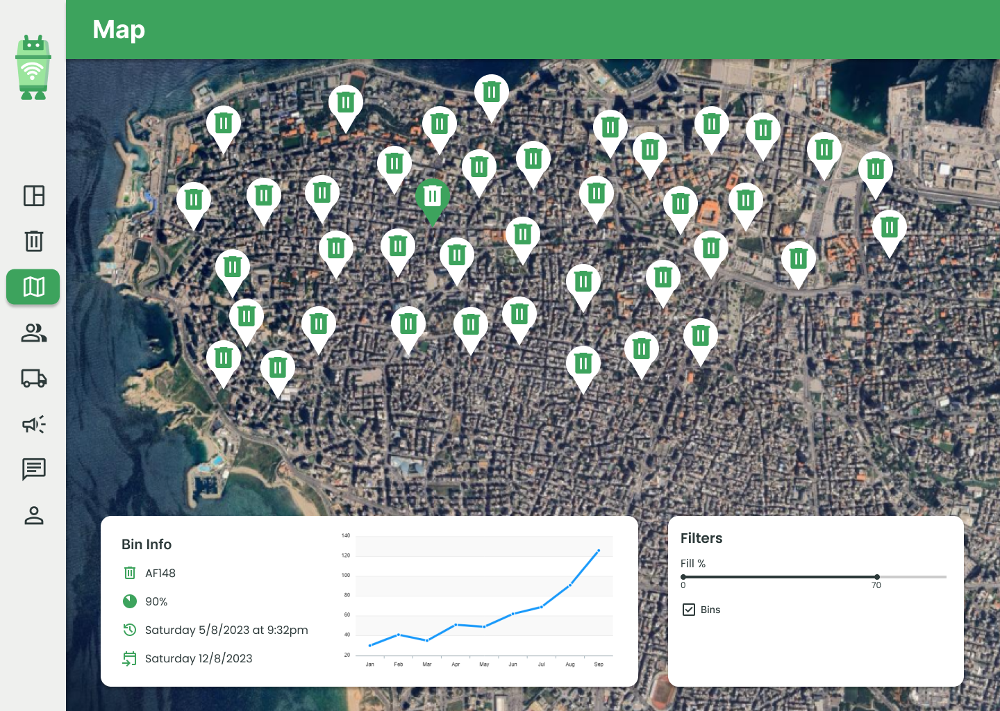| 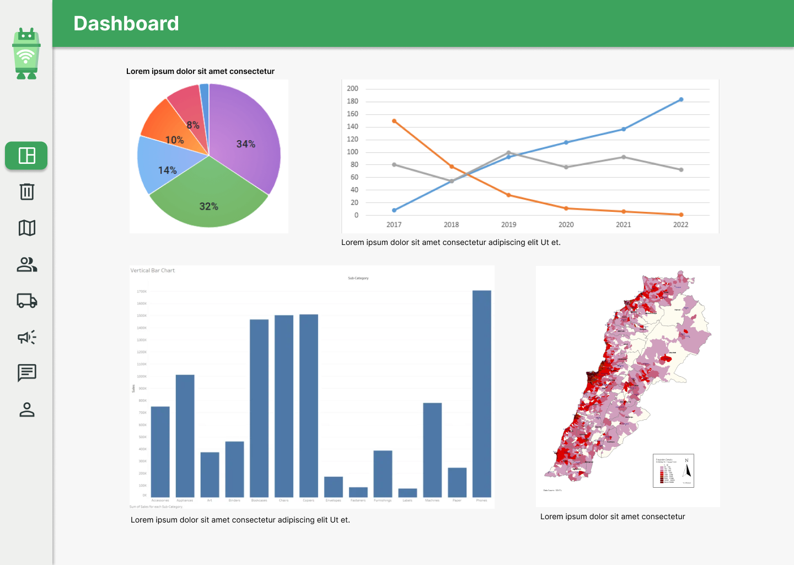| 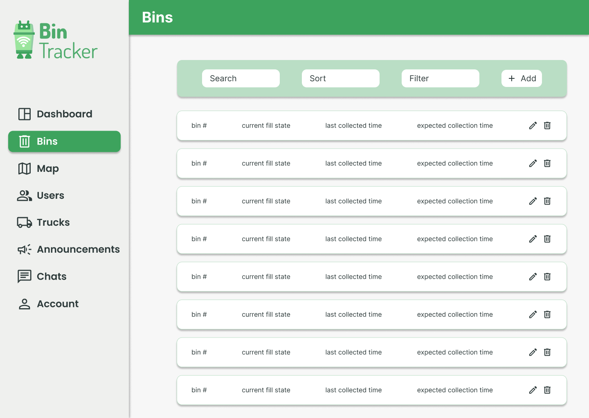|


<!-- Tech stack -->
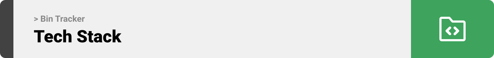


Bin Tracker is built using the following technologies

1) MERN Stack using TypeScript for the web application
	- ["React Library"](https://react.dev/) for the web application frontend development. It is a robust JavaScript library for building reusable UI components.
	- ["React Redux Library"](https://react-redux.js.org/) for state management.
	- ["Express.js Framework"](https://expressjs.com/) on [Node.js](https://nodejs.org/en) runtime environment for the backend server.
	- ["MongoDB"](https://www.mongodb.com/) for the database. It is an open source NoSQL database management system.
	- The app uses the font ["Poppins"](https://fonts.google.com/specimen/Poppins) as its main font, and the design of the app adheres to the material design guidelines.


<br>
<br>

<!-- Implementation -->
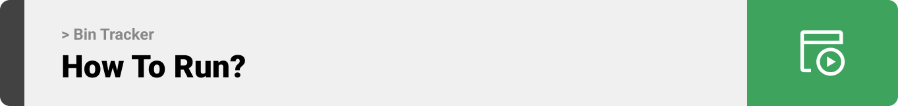


> Using the wireframes and mockups as a guide, we implemented the Bin Tracker with the following features and many more: 

### Admin

| Dashboard screen  | Create Bin screen |
| ---| ---|
| 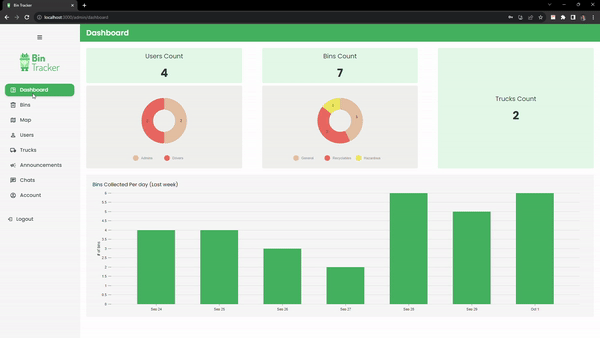 | 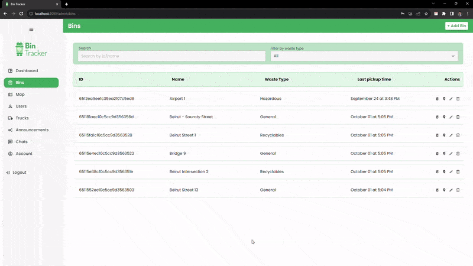 |

| Bins to Map screen |
| ---|
 |  |

| Announcements screen  |
| ---|
| 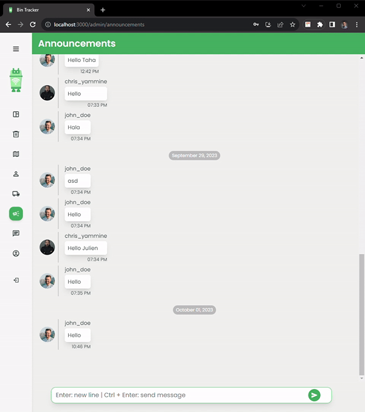|

<br><br>
### IoT
Using the Node MCU 1.0V and the ultrasonic sensor, we are tracking the fill level of the waste bin and it's location.

The Arduino board is designed to send data periodically to the server which binds them to the corresponding bin and displays them in a user-friendly way.

| Smart Bin Prototype | Circuit Design |
| ---| ---|
||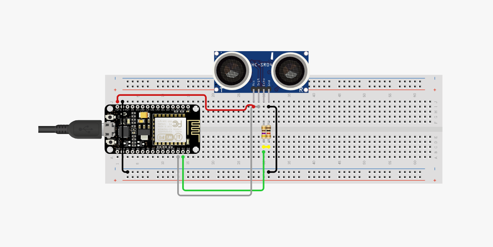

| Data Transfer Demo |
| ---|
| 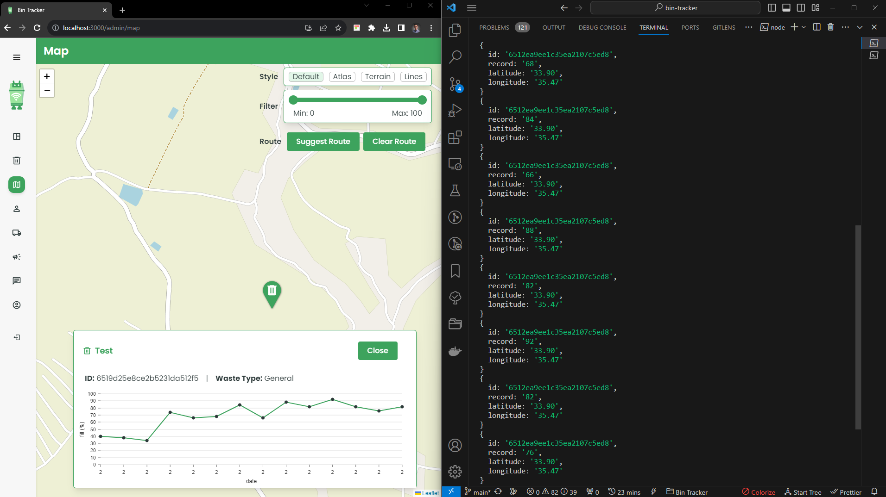 |
<br><br>


<!-- How to run -->

<br>
<br>


<!-- How to run -->


> To set up Bin Tracker locally, follow these steps:

### Running
#### Prerequisites
- Node.js & npm
	1) Follow the instructions on this link to setup Node.js: https://www.geeksforgeeks.org/installation-of-node-js-on-windows/


- MongoDB
	1) Follow the instructions on this link to setup MongoDB: https://www.mongodb.com/docs/manual/tutorial/install-mongodb-on-windows/#install-mongodb-community-edition


#### Installation


1) Clone the repo

   ```sh
   git clone https://github.com/amr-hammoud/bin-tracker.git
   ```

	The project folders consists of 4 subfolders:
	- "App" which contains the Flutter App
	- "Server" which contains the Express Server using Node.js
	- "Web" which contains the React Web App
	- "readme" which contains the files related to the readme.md

2) Install NPM packages
    - You need to install the NPM packages in both "Server" & "Web"
	- navigate to each folder and then run this command

   ```sh
   npm install
   ```

3) Setup the .env file
	- Navigate to /bin-tracker/Server
	- Rename the file named ".env.example" to ".env"
	- Replace the "ADD_YOUR_KEY_HERE" with you JWT key
	```sh
	JWT_SECRET="ADD_YOUR_KEY_HERE"
	```

4) Launch the server
	- Navigate to /bin-tracker/Server/
	- Run this command	
	```sh
	npm run dev
	```

5) Launch the app
	- Navigate to /bin-tracker/Web/
	- Run this command	
	```sh
	npm run dev
	```

6) Now the web app should be running