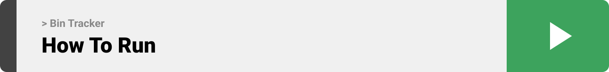

<br><br>


- [Project Philosophy](#philosophy)
  - [User Types](#user-types)
  - [Features of the App](#features-of-the-app)
- [Teck Stack](#stacks)
  - [Frontend](#frontend)
  - [Backend](#backend)
- [Prototyping](#prototyping)
- [Demo](#Demo)
  - [App](#app)
  - [IoT System](#iot)
- [How to Run](#run)
  - [Prerequisites](#prerequisites)
  - [Installation](#installation)

<br><br>
<!-- project philosophy -->
<a name="philosophy"></a>


> An IoT-based Garbage Collection System that employs sensors within waste bins to monitor their fill levels. The data from these bins are then analyzed to generate actionable insights and recommendations.
>
> Bin Tracker aims to decrease the consumption of fuel by garbage trucks and help cities become more eco-friendly.

<br> 

### User Types 

1. Super Admin
2. Group Admin (A group is a party registered on bin tracker's database and benifets from its services, e.g. Beirut Municipality)

<br> 

### Features of the App 

As a Super Admin:

- View a dashboard about all groups
- Manage groups access to services
- Manage user accounts so that they can access the website.

As a Group Admin:
- View the bins on an interactive map.
- View real-time and historical data on bins fill levels to generate reports and make decisions based on data.
- Manage the bins, so that their data stays accurate.
- Manage the trucks owned by the group.
- Communicate with users using text messages.

<br>
<br>

<!-- Prototyping -->


> We designed Bin Tracker using wireframes and mockups, iterating on the design until we reached the ideal layout for easy navigation and a seamless user experience.

### Wireframes

| Bins Map screen  | Dashboard screen |  Bin Management screen |
| ---| ---| ---|
|  |  |  |


### Mockups

| Map screen  | Dashboard screen |  Bin Management screen |
| ---| ---| ---|
| | | |


| Announcements screen  | Login screen |  Landing screen |
| ---| ---| ---|
| | | |
<br><br>

<!-- Tech stack -->
<a name="stacks"></a>

> The Website utilizes React using TypeScript for the frontend, Node.js and Express for the backend, MongoDB for database, AWS server for cloud infrastructure, and Arduino for sensor data collection.

<br>

Bin Tracker is built using the following technologies:

## Frontend
- React: for the frontend development. It is a robust JavaScript library for building reusable UI components.
- React Redux: Manages app data and state effectively.
- Axios: Enables network requests to the backend.
- Nivo: Building interactive charts.
- React Leaflet: Create interactive maps.
- socket.io-client: enables real-time bidirectional event-based communication (used for messaging).

<br>

## Backend
- Node.js with Express: Powers the backend server for API requests and logic.
- MongoDB: A NoSQL database management system, handles all data.
- Socket.io: enables real-time bidirectional event-based communication (used for messaging).
- Arduino: Utilized for sensor data collection in the bins.
- Jsonwebtoken: Manages JSON Web Tokens (JWT) for authentication.
- Mongoose: Object Data Modeling (ODM) library for MongoDB.

Bin Tracker utilizes these technologies to provide a seamless and comprehensive waste management and collection process.

<br>
<br>

<!-- Implementation -->
<a name="Demo" ></a>


> Using the wireframes and mockups as a guide, we implemented the Bin Tracker with the following features and many more: 

### App

| Dashboard Screen  | Create Bin Screen |
| ---| ---|
|  |  |

| Bins to Map Screen |
| ---|
 |  |


| Filter Bins Screen  | Update Pickup Time Screen |
| ---| ---|
|  |  |


| Announcements Screen  |
| ---|
| |


| Change Map Screen  | Edit Profile Screen |
| ---| ---|
|  |  |


| Landing Screen  |
| ---|
| |

<br><br>
### IoT
Using the Node MCU 1.0V and the ultrasonic sensor, we are tracking the fill level of the waste bin and it's location.

The Arduino board is designed to send data periodically to the server which binds them to the corresponding bin and displays them in a user-friendly way.

| Smart Bin Prototype | Circuit Design |
| ---| ---|
||

| Data Transfer Demo |
| ---|
|  |
<br><br>


<!-- Performance -->
<!-- <a name="performance" ></a>


<br>
<br> -->


<br><br>
<!-- How to run -->
<a name="run" ></a>


> To set up Bin Tracker locally, follow these steps:
#### Prerequisites
- Node.js & npm
	1) Follow the instructions on this link to setup Node.js: https://www.geeksforgeeks.org/installation-of-node-js-on-windows/


- MongoDB
	1) Follow the instructions on this link to setup MongoDB: https://www.mongodb.com/docs/manual/tutorial/install-mongodb-on-windows/#install-mongodb-community-edition


#### Installation


1) Clone the repo

   ```sh
   git clone https://github.com/amr-hammoud/bin-tracker.git
   ```

	The project folders consists of 4 subfolders:
	- "App" which contains the Flutter App
	- "Server" which contains the Express Server using Node.js
	- "Web" which contains the React Web App
	- "readme" which contains the files related to the readme.md

2) Install NPM packages
    - You need to install the NPM packages in both "Server" & "Web"
	- navigate to each folder and then run this command

   ```sh
   npm install
   ```

3) Setup the .env file
	- Navigate to /bin-tracker/Server
	- Rename the file named ".env.example" to ".env"
	- Replace the "ADD_YOUR_KEY_HERE" with you JWT key
	```sh
	JWT_SECRET="ADD_YOUR_KEY_HERE"
	```

4) Launch the server
	- Navigate to /bin-tracker/Server/
	- Run this command	
	```sh
	npm run dev
	```

5) Launch the app
	- Navigate to /bin-tracker/Web/
	- Run this command	
	```sh
	npm run dev
	```

6) Now the web app should be running
