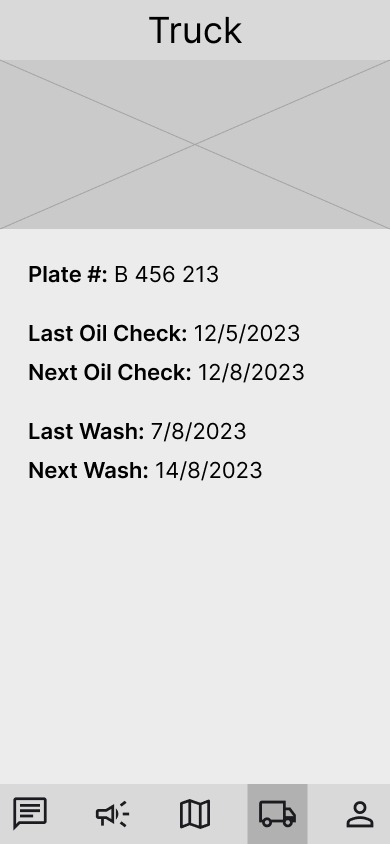

<br><br>

<!-- project philosophy -->


> An IoT-based Garbage Collection System that employs sensors within waste bins to monitor their fill levels. The data from these bins are analyzed using AI to generate actionable insights and recommendations.
>
> Bin Tracker aims to decrease the consumption of fuel by garbage trucks and help cities become more eco-friendly.

### User Stories

#### Super Admin

- As a super admin, admin, and other users, I want to login so that I can access the website.
- As a super admin, I want to create accounts so that users can access the website.
- As a super admin, I want to see accounts so that I can make decisions about them.
- As a super admin, I want to delete accounts so that users no longer have access to the website.
- As a super admin, I want to update account details so that users maintain access to the website.

#### Admin

- As an admin, I want to view real-time and historical data on bins fill levels to generate reports and make decisions based on data.
- As an admin, I want to view the bins on an interactive map.
- As an admin, I want to view the bins in a list, so that I can manage them quickly.
- As an admin, I want to add bins so that I can see their data on my dashboard
- As an admin, I want to update bin details so that their data stays accurate.
- As an admin, I want to delete bins so that their data doesn't appear on my dashboard
- As an admin, I want to filter bin data so that I can make better decisions.
- As an admin, I want to view the trucks on an interactive map.
- As an admin, I want to view the trucks in a list, so that I can manage them quickly.
- As an admin, I want to add trucks so that I can track their activity on my dashboard
- As an admin, I want to update truck details so that their activity info stays accurate.
- As an admin, I want to delete trucks so that their activity doesn't appear on my dashboard
- As an admin, I want to update my account details so that I maintain access to the website.
- As an admin, I want to create users with different permissions so that they have access to our website.
- As an admin, I want to update user details so that they maintain access to the website.
- As an admin, I want to delete accounts so that users no longer have access to the website
- As an admin, I want to send announcements to users so that I can communicate easily.
- As an admin, I want to chat with users using text messages so that we maintain live support.

#### User

- As a user, I want to have a real-time route suggestion on a map for me to follow and reduce unnecessary trips.
- As a user, I want to chat with the admins using text messages so that we maintain live support.
- As a user, I want to receive announcements from the admins so that we can communicate easily.
- As a user, I want to view my truck details so that I keep track of its maintenance schedule.
- As a user, I want to edit my profile info so that I maintain access to the system.

<br><br>

<!-- Prototyping -->


> we designed Bin Tracker using wireframes and mockups, iterating on the design until we reached the ideal layout for easy navigation and a seamless user experience.

### Wireframes (Web - Admin)

| Login screen  | Dashboard screen |  Bins Map screen |
| ---| ---| ---|
|  |  |  |

| User Management screen  | Bin Management screen |  Truck Management screen |
| ---| ---| ---|
| | | |

| Announcements screen  | Chats screen |  Account screen |
| ---| ---| ---|
| | | |

### Wireframes (Mobile - User)

| Map screen  | Truck screen |  Chats screen |
| ---| ---| ---|
| | | |

### Mockups

| Login screen  | Dashboard screen |  Landing screen |
| ---| ---| ---|
| | | |

| Bins Map screen  | Announcements screen |  Chats screen |
| ---| ---| ---|
| | | |

| User Management screen  | Bin Management screen |  Truck Management screen |
| ---| ---| ---|
| | | |

<!-- Implementation -->
<!-- 

> Using the wireframes and mockups as a guide, we implemented the Coffee Express app with the following features: 

### User Screens (Mobile)

| Login screen  | Register screen | Landing screen | Loading screen |
| ---| ---| ---| ---|
|  |  |  |  |
| Home screen  | Menu Screen | Order Screen | Checkout Screen |
|  |  |  |  | 

### Admin Screens (Web)

| Login screen  | Register screen |  Landing screen |
| ---| ---| ---|
|  |  |  |
| Home screen  | Menu Screen | Order Screen |
|  |  |  |

<br><br> -->

<!-- Tech stack -->


### Bin Tracker is built using the following technologies

- This project uses ["React Library"](https://react.dev/) for the webapp frontend development. It is a robust JavaScript library for building reusable UI components.
- This project uses ["React Redux Library"](https://react-redux.js.org/) for state management.
- This project uses ["Express.js Framework"](https://expressjs.com/) on Node.js runtime environment for the backend server.
- This project uses ["MongoDB"](https://www.mongodb.com/) for the database. It is an open source NoSQL database management system.
- This project uses the [Flutter app development framework](https://flutter.dev/) for the mobile application. Flutter is a cross-platform hybrid app development platform which allows us to use a single codebase for apps on mobile, desktop, and the web.
- To send local push notifications, the app uses the [flutter_local_notifications](https://pub.dev/packages/flutter_local_notifications) package which supports Android, iOS, and macOS.
- The app uses the font ["Poppins"](https://fonts.google.com/specimen/Poppins) as its main font, and the design of the app adheres to the material design guidelines.

<br><br>

<!-- How to run -->


> To set up Bin Tracker locally, follow these steps:

## Web App
### Prerequisites (Windows)

- Node.js & npm
	1) Follow the instructions on this link to setup Node.js: https://www.geeksforgeeks.org/installation-of-node-js-on-windows/


- MongoDB
	1) Follow the instructions on this link to setup MongoDB: https://www.mongodb.com/docs/manual/tutorial/install-mongodb-on-windows/#install-mongodb-community-edition


### Installation (Windows)


1) Clone the repo

   ```sh
   git clone https://github.com/amr-hammoud/bin-tracker.git
   ```

	The project folders consists of 4 subfolders:
	- "App" which contains the Flutter App
	- "Server" which contains the Express Server using Node.js
	- "Web" which contains the React Web App
	- "readme" which contains the files related to the readme.md

2) Install NPM packages
	You need to install the NPM packages in both "Server" & "Web"
	navigate to each folder then run this command

   ```sh
   npm install
   ```

3) Setup the .env file
	- Navigate to /bin-tracker/Web
	- Rename the file named ".env.example" to ".env"
	- Create a JWT key
	```sh
	JWT_SECRET="ADD_YOUR_KEY_HERE"
	```

4) Launch the server
	- Navigate to /bin-tracker/Server/
	- Run this command	
	```sh
	npm run dev
	```

5) Launch the app
	- Navigate to /bin-tracker/Web/
	- Run this command	
	```sh
	npm run dev
	```

6) Now the web app should be running, you can login to the app using:
	1) For the super admin:
		- username: super_admin
		- password: password
	
	2) For the admin:
		- username: admin
		- password: password


## Mobile App

### Prerequisites
In Order to use the app you need to
1) Have the web app setup and running
2) Create an account for the driver using the super admin account

### Installation
#### On Android Phones:
1) Download the ".apk" file from this link (will be added soon)
2) Install the ".apk" file
3) Make sure to have